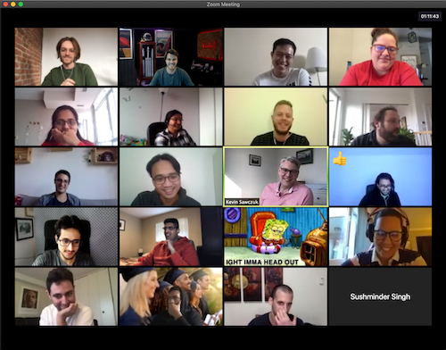

I spent the better part of two years convincing myself to pursue a data science bootcamp fulltime.  I was always debating the timing, if I had enough experience at my last position to build from and of course getting finances in order.  Then I made the jump and left my previous position as a Production Engineer for an oil and gas company in Houston and committed 100% to this evolution just days before the first official cases of COVID-19 appeared in Wuhan and would soon rattle the world. So much for timing :) 

What began as a plan to return to Denver, CO where I went to College for an in person course quickly pivoted into a full remote online learning environment.  I built a home office like millions of others and dove in.  At first there was some disappointment that I would be missing out on the experience of going back to school and meeting new people but that quickly faded as I made many new friends all in very different, but somewhat similar situations pursuing a great evolution in the midst of a challenging pandemic.

The remote experience has been very valuable.  Zoom meetings, slack channels, and shared drive documents became our lifeblood like so many others working from home.  The ability to learn an entirely new and complex subject in a remote environment has taught me that if we leverage technology and talented people we can still achieve great things together, even when we are apart.

    

### The Projects ###

I spent a lot of time leading up to the bootcamp utilizing various online resources to build up my skillset.  This helped give me an edge as the material was familiar to me, but the experience of sitting in a room and working through problems together made traversing the vast world of data science engaging and solidified the concepts.  

Although working through the excersizes together in class was a great learning experience, the real value came from the experience working on projects.  From practicing the data cleaning and preprocessing fundamentals with general election and demographic data from the presidential elections and U.S. censor, respectively, to performing extensive natural language processing and machine learning modeling to predict positive and negative reviews the projects provided a great opportunity to reinforce the foundational concepts with real world applications.

The most valuable project, however is the capstone project.  It is a personal, open-ended and unguided project where each student chooses their own business problem to address and creates the project from scratch.  This includes data acquisition, cleaning, preprocessing, modeling as well as a formal report communicating results and a high level video presentation.  The project I chose is a netflix-style recommender system for video games called MyGamePass and I can't wait to tell you all about it in the next post!