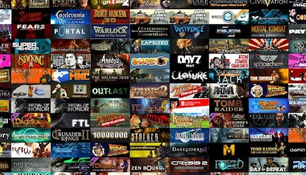
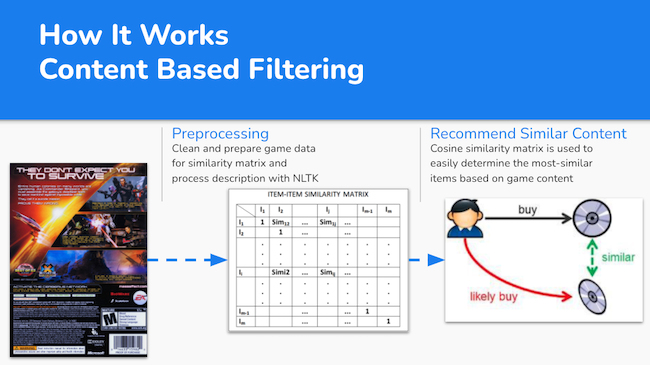
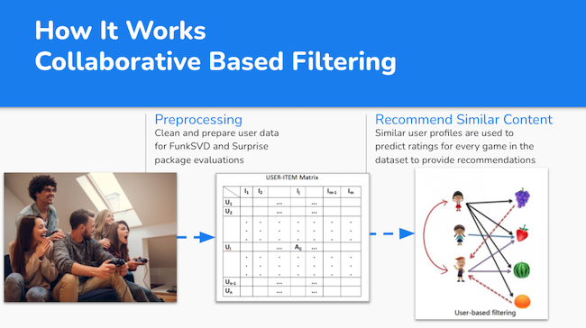

The capstone process can be a bit of a rollercoaster ride.  At first, it seems a bit daunting trying to come up with an idea for a machine learning project when you are just getting introduced to the concepts.  Then you get excited when you realize what may be possible and start dreaming big hoping to change the world with your very first project.  Of course, some humbling occurs and you realize the challenges involved with juggling the course content, personal life, and the capstone and those big dreams get whittled down into realistic goals and future aspirations.  Then you dive in and really get to work bringing it to life!

That may not be how it goes for everyone, but it is how my project progressed.  Initially I was a bit overwhelmed, not knowing what the timeline was for the various scales of projects I was considering.  I landed on two good ideas (I won't spoil the second, check back later for an update there) and decided to go with the netflix-style recommender system for video games.  I chose this for multiple reasons, but primarily because I wanted to understand how they worked due to the prevalance of these systems throughout every industry and how much impact they have in our day to day life.  Additionally, in terms of machine learning problems it is a concept I am familiar with - I am a passionate gamer and have made many personal recommendations to friends of mine in the past, so the domain knowledge made me comfortable with the dataset and project goal.

    

The <a href="https://www.github.com/polzinben/MyGamePass" target="_blank">GitHub repo</a> contains a more thorough breakdown of each step, but I will go over the high level process here as well. For this project I landed on two datasets found on kaggle.com that were well-suited for the project.  One of the main challenges with this problem that provided plenty of learnings was preparing my data for the modeling.  I chose to focus on NLP of the game description to find similar games based on content.  Additionaly, I was able to utilize user engagement to provide collaborative recommendations based on how many hours other games were played but first I needed to address outliers and convert hours played into a 1-10 rating for compatibility with the model.

The recommendation system leverages matrix factorization in two ways.  First, when performing a content based filtering system used NLP on the descriptions to create a collection of games and their descriptions in a matrix.  The model is then able to find games with similar descritions and provide recommendations based on various thresholds (average rating, number of users, etc).  This is commonly seen throughout the real world, for example Netflix will often say "because you watched X, you may like Y".

    

Alternatively, I also explored collaborative filtering.  What this does is creates a matrix of each user and the associated rating for each game.  The model then learns from this dataset and is able to find many "hidden features" (for example a preference for new I.P. vs sequels, fans of sci-fi, etc) to determine similar user profiles and provide anticipated recommendations to you based on those similar users preferences.  This is also a familiar system, for example Netflix or Amazon will often say outright "Users like you also watched/purchased...".  

    

This project provided a fantastic opportunity to push myself to identify a problem statement that can be pursued with machine learning, acquiring a relevant dataset and performing all cleaning and preprocessing necessary for modeling, and then of course performing the machine learning modeling and evaluating the results.  This unguided project forced me to solve problems that I had not seen before and did not have a clear "solutions manual" to reference.  The best way to learn is by doing, and this project taught me a lot technically but more importantly it taught me time management, attention to detail, and perserverance.  Looking forward to sharing more with you soon!