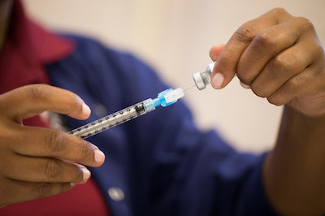

For my first portfolio project outside of the BrainStation Diploma Program I looked for a challenge, but something more structured with a clear evaluation criteria to measure myself against and found this open competition <a href="https://www.drivendata.org/competitions/66/flu-shot-learning/" target="_blank">@DrivenData.org</a>.  The challenge - can we predict whether people received H1N1 and seasonal flu vaccines using information they shared about their backgrounds, opinions, and health behaviors?  Spoiler alert, we can do a pretty decent job with a well tuned yet simple model.

    

The dataset was provided in separate files (train features, train labels, and test features) with a thorough data dictionary.  The details can be found on either the competition website or my <a href="https://github.com/polzinben/driven_data_flu_vaccines" target="_blank">GitHub repo</a>.  Although at first this seemed like a straightforward problem, I quickly ran into an issue I had never seen before - a multi-label dataset.  The standard train_test_split approach I had become familiar with would not work in this situation.  Ultimately I would find a custom multilabel_train_test_split module online and would import it for my needs.  

The challenge did not end with the preprocessing, however, as I had also never performed a multilabel classification before.  For an added layer of complexity, it is actually a step short of a hard classification as the submission required the probabilistic prediction for each option (the probability that person received the H1N1 and the seasonal flu vaccine separately).

    

The learnings did not end there either, as it was an additional challenge properly formatting and outputing the results for the standardized submission.  In the end, my model would significantly outperform the benchmark score and placed in the top 18% of all submissions!  It provided the challenge I was seeking and plenty of learning experiences along the way.  Looking forward to the next one!