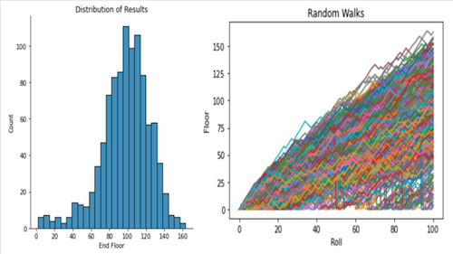

I was honored to be chosen to join the team as a Teaching Assistant after completing my own diploma program.  It was a goal of mine entering the program, and I demonstrated the understanding of the material, enthusiasm, dedication, and leadership qualities BrainStation was looking for.  It provided a great opportunity to continue to learn as well as provide mentorship in addition to the administrative responsibilities.

As a teaching assistant I was reponsible for delivering codealong review sessions to reinforce the fundamental concepts as well as provide mentorship and tutoring to the students.  Administrative responsibiliies involved marking assignments and providing feedback to the students as well as general assistance to the education team.  Delivering the codealong sessions was particularly valuable as there is an added level of pressure "when the bullets start flying" during live coding sessions.  Teaching and explaining content requires a deeper understanding, and I was tested regularly by inquisitive students and it made me a better data scientist.

One of the highlights of the term came when I was able to deliver a simple lesson I created.  I have to give credit where it is due, the lesson was heavily inspired by Hugo Bowne-Anderson's intro lesson <a href="https://learn.datacamp.com" target="_blank">@datacamp</a> with a few notable additions including user defined functions, list comprehension, and some tweaks to the ruleset of the game. 

### Would You Like to Play a Game? ###

The premise is a simple game between you and a friend, you roll two dice and combine the scores with the result of the score determining if you travel up the 162 floor Burj Khalifa for an even roll, or down the stairs for an old roll.  It is a little more complex than that, but the proposition is you will not make it above 90 floors if you roll the dice 100 times and play the game.  Do you take the bet?  It is very difficult to say off-hand, you could potentially enlist some highly advanced math to approach the problem, but we're data scientists!  Compute power to the rescue.

    

That's the fundamental takeaway of the lesson, leveraging computers to help solve complex problems and using the central limit theorem to perform "hacker statistics".  What this means is, we can program the rules of the game into a computer and simulate the process as many times as we want, tracking the results of 100 rolls.  We can then simply use the mean of the results to confidently predict the outcome.  In this case, we simulated the game 1,000 times and plotted the results.  Turns out, we would expect to reach floor 90 or above 65.7% of the time!  The power of the central limit theorem and computers :) It is fascinating, and the foundation of data science!

    

